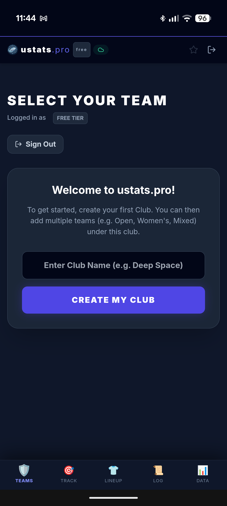
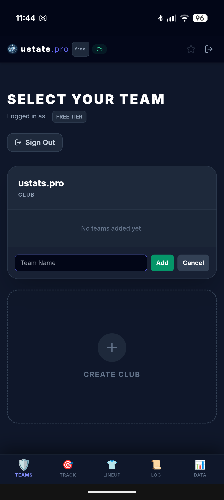
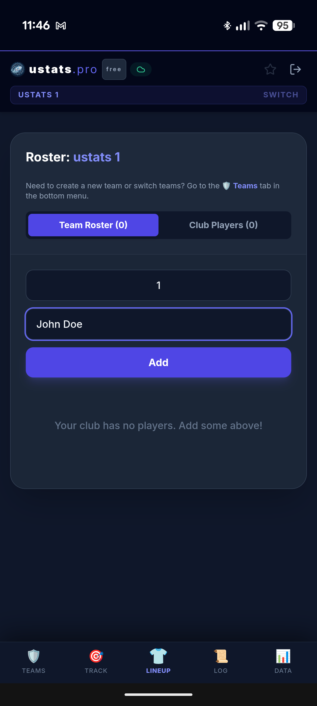

<div align="center">
  
  <h1>UStats Pro</h1>
  <p><b>The Complete User Guide</b> (v 2026‑05‑21)</p>
</div>
---

## 📖 Introduction
UStats Pro is a **web‑based, cross‑platform** application for tracking Ultimate Frisbee games. It runs on modern browsers (desktop, iOS, Android) and stores all data in **Supabase**, giving you automatic cloud sync and offline fallback.

> **Note:** The *Voice Pro* feature (advanced voice‑command interface) is **coming soon** – the current voice support is limited to basic start/undo commands.

---

## 1️⃣ Getting Started
### 1.1 Open the App
1. Navigate to **https://ustats.pro** on any device.
2. Click **Log in / Sign up** (top‑right corner).
3. Choose an authentication method – email/password or Google/Apple.
4. Verify your email if you used the email method.

### 1.2 First‑time Onboarding Wizard
| Step | What you do | Screenshots |
|------|--------------|-------------|
| **Create a Club** | Enter a club name (e.g., *Rouvin Ultimate*). Optionally upload a logo. |  |
| **Create a Team** | Choose the club, give the team a name (e.g., *UStats Pro A*), and select a **team colour** for UI accents. |  |
| **Add Players** | You’ll be taken to the **Player Roster** screen (see Section 3). |  |

Once the wizard finishes you land on the **Dashboard** for the newly created team.

---

## 2️⃣ Club & Team Management
### 2.1 Clubs
- **Create a new club** → Settings (gear icon) → *New Club*.
- **Edit club** → change name, logo, or delete the club (deleting a club also deletes all its teams).

### 2.2 Teams
- **Add a team** → Inside a club → *Add Team*.
- **Rename / Delete** → Hover over the team name in the sidebar to reveal edit/delete icons.
- **Cascade Delete** – deleting a team automatically removes:
  - Players linked to the team
  - All recorded stats and points
  - Managed line templates attached to the team

### 2.3 Admin Impersonation Lock (Glassmorphic Blocker)
When an admin logs in **without a shadow team**, the UI covers the main view with a semi‑transparent glass effect and a message: *“You must select a shadow team to continue.”* This prevents accidental data changes.

---

## 3️⃣ Player Roster
### 3.1 Adding Players
1. Click **Players** in the left navigation.
2. Press **+ Add Player**.
3. Fill the form:
   - **Name** (required)
   - **Jersey Number** (optional)
   - **Position** (handler, cutter, etc.)
   - **Active** toggle – determines if the player can be selected for a lineup.
4. Click **Save**.

### 3.2 Editing / Deleting Players
- Hover a player row → **Edit** (pencil) or **Delete** (trash) icons appear.
- Deleting a player also removes them from any saved Managed Lines.

### 3.3 Bulk Actions
- Use the checkbox column to select multiple players.
- Bulk **Toggle Active** → change all selected players to active/inactive.
- Bulk **Delete** → remove several players at once (confirmation dialog appears).

---

## 4️⃣ Managed Lines (Line Templates)
> **Managed Lines** are reusable line‑ups you can save, edit, and reuse across games.

### 4.1 Opening the Managed Lines Modal
1. In **Lineup Selector**, click the **Manage Lines** button (bottom left, icon with three horizontal lines).
2. The modal slides in with a dark glass backdrop.

### 4.2 Creating a New Line
1. In the **Left Column**, click the **+** button.
2. Enter a **Line Name** (e.g., *Starting 7*). Press **Enter** or click the **+** icon.
3. The line appears in the list with a badge showing the number of players selected (initially 0).
4. Click the line name to move to the **Right Column**.
5. In the right column, you see a list of all team players with a **checkbox**‑style button.
   - Click a player to **toggle selection** – the button turns indigo when selected.
   - Selected players show a **check‑mark** icon.
6. When you’re satisfied, the badge updates automatically.

### 4.3 Editing an Existing Line
- Click any line in the left column → the right column loads its player selection.
- Add or remove players as described above. Changes are saved instantly.

### 4.4 Deleting a Line
- Click the **trash** icon next to the line name (or open the line and press the **Delete Line** button at the top of the modal).
- Confirm the deletion in the browser dialog.

### 4.5 Syncing Managed Lines Across Devices
1. **On Load** – the app reads `localStorage` (`lines_<teamId>`) for instant UI rendering.
2. If online, it calls `fetchManagedLines(teamId)` (Supabase `teams.managed_lines` column) and replaces the local list with the cloud version.
3. **Saving** – every time you add/edit/delete a line, the UI calls `saveManagedLines(teamId, newLines)`. The function updates the cloud column **asynchronously**, while the local copy is updated instantly.
4. **Offline Fallback** – if you lose connectivity, changes stay in `localStorage`. When the device regains a connection, the next mount will push pending changes automatically.

> **Important:** The first time you use Managed Lines, the app will attempt to create the `managed_lines` column automatically via the migration script you ran in Supabase. If you see a warning, run:
> ```sql
> ALTER TABLE public.teams ADD COLUMN IF NOT EXISTS managed_lines JSONB DEFAULT '[]'::jsonb;
> ```

---

## 5️⃣ Selecting a Line & Starting a Point
### 5.1 Choosing a Line
1. Open **Lineup Selector** (main screen after selecting a team).
2. Click a line from the **Lines** list on the left. The UI highlights the active line.
3. The player list on the right updates to show which players are selected.

### 5.2 Validation Rules
- **Grass (7‑player) games:** Expected count = **7**.
- **Beach / Indoor (5‑player) games:** Expected count = **5**.
- **Training / Drill:** No specific count required.

If the selected line does **not** match the expected count, a **modal** appears:
```
You selected X players, but a <game‑type> game usually expects Y. Start point anyway?
```
You can press **OK** to proceed or **Cancel** to adjust the line.

> **Note:** We removed the previous auto‑start feature. After confirming the line, you **must press the “Start Point” button** manually.

### 5.3 Starting a Point
1. Ensure **Match Name** (field at top) is filled.
2. For a non‑training game, fill **Opponent Name** and set **Starting Possession** (O/D).
3. Press **Start Point**.
4. The app:
   - Clears any previously active lineup in Supabase (`clearActiveLineup`).
   - Records the new lineup (`recordLineup`).
   - Emits **audio** and, if enabled, **haptic** feedback.
   - Increments the point counter.

---

## 6️⃣ Audio & Haptic Feedback
| Setting | Description |
|---|---|
| **Audio** | Plays a short click sound at point start. Toggle in **Settings → Audio Feedback**. |
| **Haptic** | Triggers a 30 ms vibration on devices that support it (Android phones, iOS devices with Vibration API). Enable via **Settings → Haptic Feedback**. |

If you experience **no vibration on iOS**, go to **Settings → Safari → Advanced → Allow Web App Vibration**.

---

## 7️⃣ Voice Commands (Current) & Voice Pro (Coming Soon)
### 7.1 Current Voice Support
- **Start Point** – say “Start point”.
- **Undo Point** – say “Undo point”.
- Voice must be enabled in **Settings → Voice Commands**. The microphone icon appears in the top‑right toolbar.

### 7.2 Voice Pro (Coming Soon)
- Full‑sentence natural language (e.g., *“Record a pull for player 12 and start the next point.”*)
- Automatic transcription with AI‑powered intent detection.
- Multi‑language support.
- Scheduled release: **Q4 2026**.

---

## 8️⃣ Pull Tracker & Stats
- The **Pull Tracker** bar at the top shows:
  - Current point number.
  - Half‑time indicator (green when a half‑time has been logged).
  - A **Reset** button to clear the current point (available only to admins).
- All stat entries (pulls, blocks, goals, turnovers, etc.) are stored in Supabase `stats` table.
- If offline, entries are queued in IndexedDB and synced when back online.

---

## 9️⃣ Coach Dashboard
### 9.1 Active‑Player Count Button
- Shows **green** when the active lineup meets the expected player count for the selected game type.
- Hover tooltip: *“7 players selected – ready to start point.”*
- Clicking the button opens a **quick‑view** of the selected players.

### 9.2 Export PDF Report
1. In the dashboard, click **Export PDF** (top‑right).
2. Choose a filename and press **Download**.
3. The PDF contains:
   - Team & match metadata
   - Full point‑by‑point lineup list
   - All recorded stats in a table format
   - A summary page with totals per player.

### 9.3 True Impact Master Roster & Metrics Reference
The **True Impact Master Roster** (or Coach Pro Impact Matrix) is a sortable analytical table listing 16 key metrics evaluating individual player efficiency and direct tactical contribution. Below is the detailed calculation reference:

| # | Column | Metric / Description | Calculation Formula | Weighting / Coaching Rationale |
|---|---|---|---|---|
| **1** | **Player** | Name & On/Off Net Margin | `(Points Won on Field) - (Points Lost on Field)` | Tracks raw score differential when active. Does not adjust for line starting bias. |
| **2** | **PP** | Points Played | `Holds Played + Breaks Played` | Measures active playtime volume and sample size. |
| **3** | **O/D** | Offense/Defense Point Split | `O-Points / D-Points` | Highlights O-Line vs. D-Line deployment. |
| **4** | **Touches** | Total Disc Possessions | `Total Actions - Pulls` | Measures direct offensive involvement. |
| **5** | **Touches/Pt** | Workload per Point | `Touches / Points Played` | Handlers average >3.0 (high volume); Cutters average <2.0 (high efficiency). |
| **6** | **G/A/SA/D** | Direct Box Score events | • **Goals (G):** catching scores<br>• **Assists (A):** throwing final pass of score<br>• **Secondary Assists (SA):** pass before assist<br>• **Blocks (D):** defensive turnovers generated | **Secondary Assists (SA)** rewards setup handlers. Blocks are weighted heavily in utility formulas. |
| **7** | **Turnovers** | Total offensive errors | `Throwaways (T) + Drops (D) + Stalls (S)` | pinpoints where the offensive execution failed. |
| **8** | **Passes (C/A)** | Completed/Attempted passes | `Completed Passes / (Completed + Throwaways + Receiver Drops)` | Total distribution attempts by the player. |
| **9** | **Comp %** | Passing accuracy rate | `(Completed / Attempted) * 100` | Handlers should ideally target >90% completion. |
| **10** | **Deep Throws** | Huck Completed/Attempted | `Hucks Completed / Hucks Attempted` | Isolates deep-throwing efficiency from short play. |
| **11** | **System Impact %** | Baseline-adjusted scoring efficiency shift | See **System Impact Formula** below | Corrects for starting line bias. Winning a D-Line break is rewarded with a **2.0x Break Bonus**. |
| **12** | **OCE %** | Offensive Conversion Efficiency | `(Goals on Pitch / Possessions Played) * 100` | Measures team's ability to score per possession while active. |
| **13** | **OVA** | Offensive Value Added | `(Clean Holds * 0.5) + (Assists * 2.0) + (Secondary Assists * 1.5)` | Heavy emphasis on play distribution and mistake-free O-points (Clean Holds). |
| **14** | **Pull Impact** | Average pull quality | `Sum of Pull Scores / Total Pulls` | Pulls graded 0.0–5.0 based on depth and hangtime. |
| **15** | **Usage** | Touch Share | `(Player Touches / Team Touches) * 100` | Evaluates balance; usage >30% indicates centralized risk. |
| **16** | **NIS** | Net Impact Score (HOLISTIC RATING) | See **NIS Metric Formula** below | standardizes player efficiency per point. Penalizes turnovers (-2.0) but softens huck turnovers (-1.5). |

---

#### 🧮 Detailed Advanced Formulas

##### 1. System Impact %
Grades every played point against the team's tournament average (baselines) to remove O/D starting line bias:
*   **Offense Start (O-line):** $\text{Impact} = \text{Result} - \text{Global Hold Rate}$ *(Result = 1 if team held, 0 if team was broken)*
*   **Defense Start (D-line):** $\text{Impact} = (\text{Result} - \text{Global Break Rate}) \times 2.0$ *(Result = 1 if team broke, 0 if opponent held. Positive break impact receives a 2.0x Break Bonus)*
*   **System Impact %** = $\frac{\sum \text{Weighted Impacts}}{\text{Points Played}} \times 100$

##### 2. NIS (Net Impact Score)
Holistic utility score per point played, heavily weighting positive actions while penalizing turnovers:
$$\text{NIS} = \frac{(G \times 2.0) + (A \times 1.5) + (D \times 2.0) + (P_{\text{comp}} \times 0.3) + (H_{\text{comp}} \times 0.7) - (TO \times 2.0) + (TO_{\text{huck}} \times 0.5)}{\text{Points Played}}$$
*   **Huck Completion Bonus:** Huck completions receive $+0.7$ on top of $+0.3$ standard pass, rewarding completed deep looks with a full $+1.0$.
*   **Huck Turnover Discount:** Huck turnovers (throwaways or drops) receive a $+0.5$ recovery credit, reducing the normal $-2.0$ turnover penalty to a net $-1.5$ due to their lower field position cost.

---

## 🔧 Settings & Preferences
| Setting | Location | Options |
|---|---|---|
| **Audio Feedback** | Settings → Audio | On / Off |
| **Haptic Feedback** | Settings → Haptic | On / Off |
| **Voice Commands** | Settings → Voice | On / Off (current) |
| **Sync on Wi‑Fi only** | Settings → Sync | Wi‑Fi only / All networks |
| **Theme** | Settings → Appearance | Light / Dark (auto) |
| **Language** | Settings → Language | English (default) – other languages planned |

All settings are stored in **Supabase user profile** and synced across devices.

---

## 🛠️ Advanced Operations
### Export / Import
- **Export JSON** → Settings → *Export Data* → download a `.json` file containing the entire team (players, lines, stats).
- **Import JSON** → Settings → *Import Data* → select a previously exported file.
- The import process validates schema compatibility and merges data, preserving existing IDs.

### Multiple Clubs / Teams
- Use the **Club selector** dropdown at the top‑left to switch between clubs.
- Each club can have multiple teams; the UI updates instantly.

---

## ❓ Troubleshooting & FAQ
| Issue | Solution |
|---|---|
| **Managed lines not syncing** | Ensure you are online. The app will fallback to local storage. Verify the `managed_lines` column exists in Supabase (`SELECT * FROM teams LIMIT 1`). |
| **Zero‑players selected warning** | This warning appears when you select a managed line that has **0** players saved. Edit the line in the Manage Lines modal and add players. |
| **Audio/haptic not playing on iOS** | iOS requires user interaction before enabling audio. Tap anywhere on the screen first, then enable the setting. |
| **Undo does not revert the lineup** | The Undo button restores the previous point’s lineup from IndexedDB. If you cleared the browser cache, the undo history is lost. |
| **Voice commands not recognized** | Make sure microphone permission is granted. Speak clearly and pause briefly after each command. |
| **Database migration required** | Run the following SQL in Supabase:
```sql
ALTER TABLE public.teams ADD COLUMN IF NOT EXISTS managed_lines JSONB DEFAULT '[]'::jsonb;
``` |
| **App shows a glass blocker after login** | You are logged in as an admin without a shadow team. Choose a shadow team in the admin panel or ask an owner to assign one. |

---

## 📞 Support & Community
- **Email:** support@ustats.pro
- **Discord:** https://discord.gg/ustats
- **GitHub Issues:** https://github.com/RouvInUK/UFStats/issues

We welcome feature requests, bug reports, and community contributions!

---

*This guide is generated from the latest codebase and will be updated automatically with each release.*
